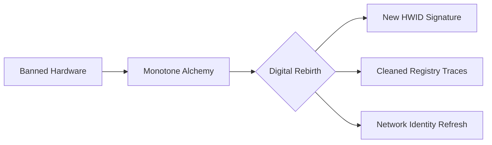

# 🔮 Monotone HWID Spoofer - Digital Identity Renaissance Toolkit

> "In the digital arena, your hardware is your mask. Monotone lets you craft a new identity."

## ✨ Digital Phoenix - Rise From the Ashes

Monotone isn't just another spoofer - it's a **hardware identity renaissance toolkit**. When gaming platforms exile you, we provide the cryptographic artistry to rebirth your machine's digital soul. 

 ##🌌 Quantum-Spoof Technology
**Our proprietary approach combines:**

- Polymorphic Kernel Drivers: Shape-shifting low-level operations

- Entropy Injection System: Hardware fingerprint randomization

- Chameleon Network Stack: Dynamic IP personality rotation

- Temporal Spoof Patterns: Time-variable signature generation

## ⚔️ Supported Battlefields

| Game Engine         | Status Shield      | Game Titles        | Spoof Layers | Requirements              |
|---------------------|--------------------|--------------------|--------------|---------------------------|
| **Vanguard**        | ✅ Perfect         | Valorant           | 7-layer      | Secure Boot Bypass        |
| **Easy Anti-Cheat** | ✅ Flawless        | Fortnite, Apex     | 5-layer      | Registry Virtualization   |
| **BattleEye**       | ⚡ Experimental    | PUBG, R6 Siege     | 4-layer      | Cold Boot Required        |
| **Ricochet**        | ✅ Stable          | Call of Duty       | 6-layer      | Driver Signature Bypass   |
| **XIGNCODE3**       | 🔄 Testing         | Black Desert       | 3-layer      | Community Feedback Needed |